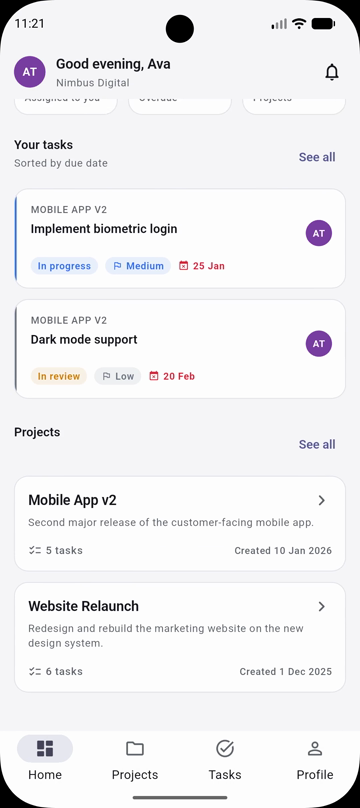
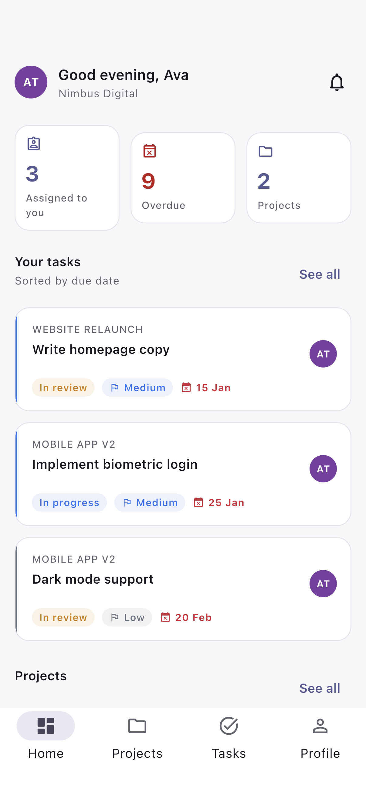
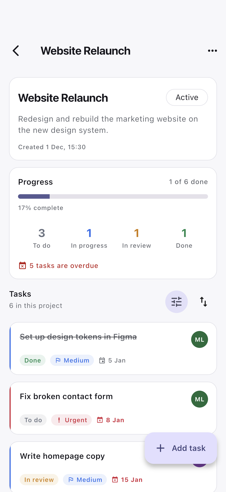
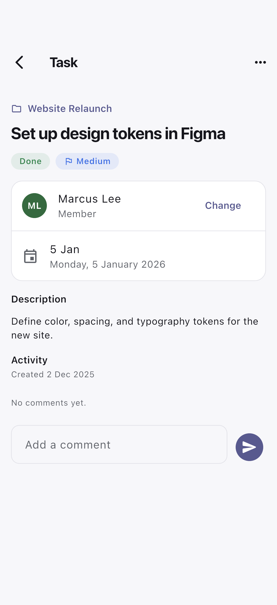
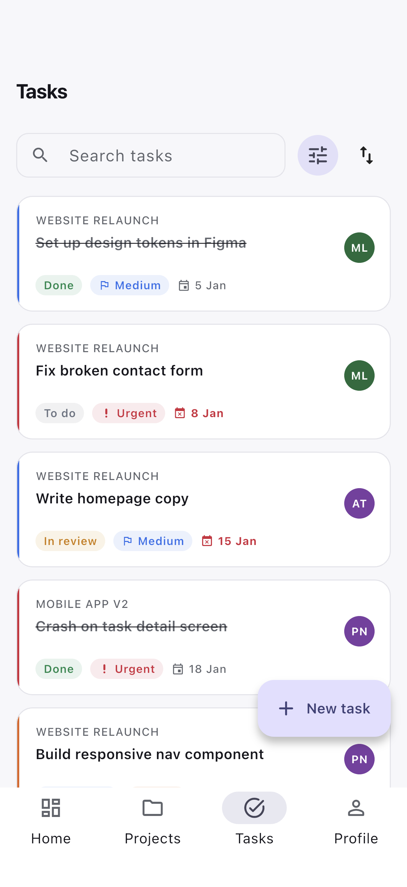
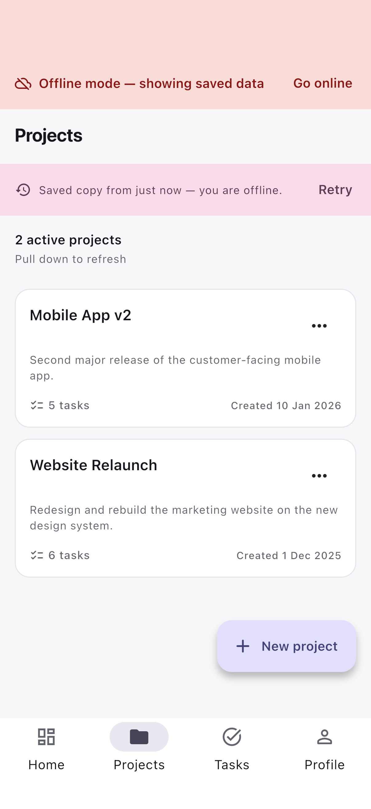
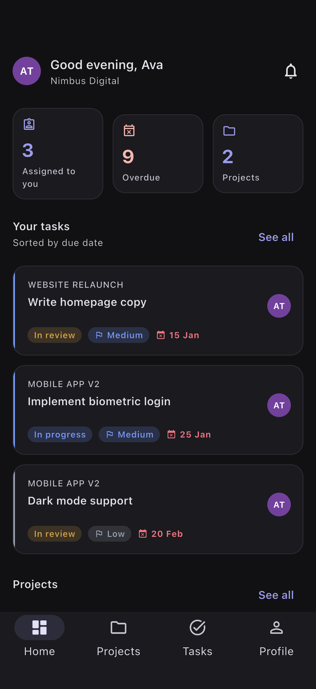
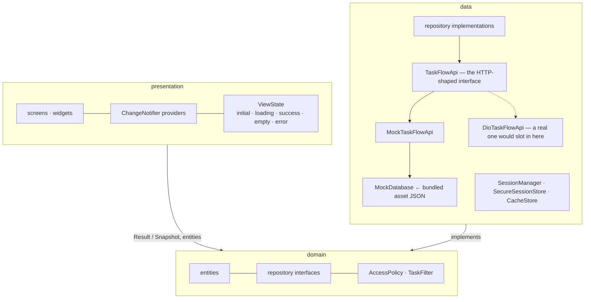
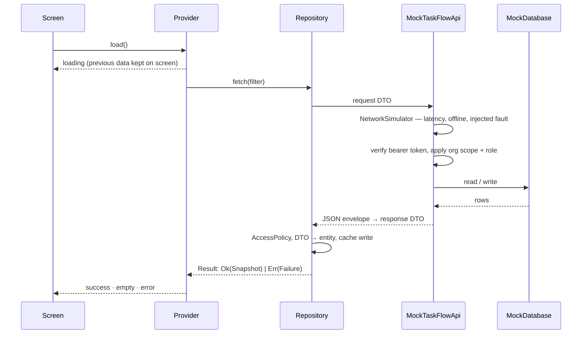
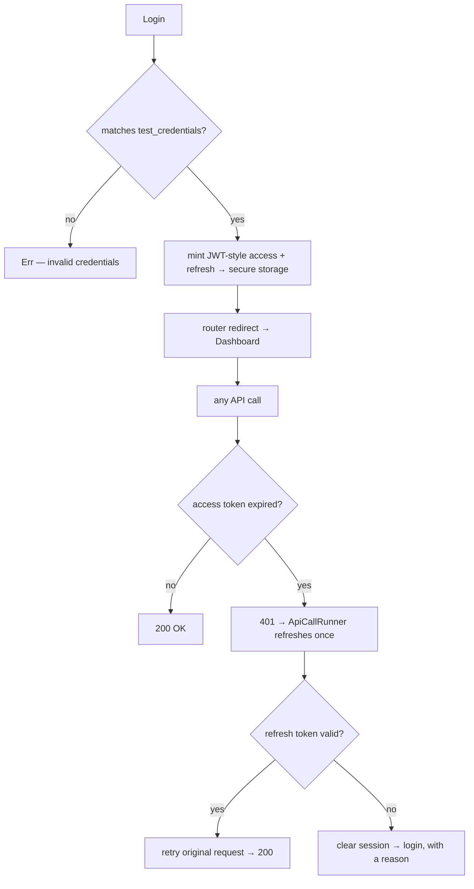

# TaskFlow

A lightweight project and task manager for organizations — projects, tasks,
member assignment, comments and notifications, with role-based rules and an
offline mode.

<p align="center">
  <a href="https://taskflow-app-five-mauve.vercel.app"></a>
  <a href="#-download-the-apk"></a>
  <a href="Demo%20Task%20Flow.mp4"></a>
  <a href="#-screens"></a>
  <a href="#-architecture"></a>
</p>

<p align="center">
  
  
  
  
  
</p>

---

## 📖 About the project

TaskFlow is the full loop an organization needs to run work: an admin creates a
project, adds tasks, assigns them to members, and everyone comments, changes
status and gets notified. Members see the same data but cannot create or destroy
it — the role is enforced, not just hidden.

Everything runs against a **simulated backend** that reads one bundled JSON
asset. There is no network call anywhere in the app. The layering, though, is
exactly what it would be against a real REST API: `TaskFlowApi` is written as an
HTTP client — one method per endpoint, request DTOs in, response DTOs out,
`ApiException` with a status code on failure — and swapping in a real
`DioTaskFlowApi` means writing one class and changing one line of DI wiring.
Nothing in `domain` or `presentation` moves.

**What it does**

- Organizations with two roles: **admin** (full control) and **member** (read,
  comment, update the status of their own work)
- Projects and tasks with priority, status, due dates and assignment
- Per-task comments and a notification inbox that deep-links into the task
- Offline mode: reads fall back to the last saved copy with a *Saved copy from …*
  banner; a mutation while offline fails with a retryable message
- Simulated latency, faults, token expiry and refresh — so every loading and
  error state in the UI is reachable on demand
- Dark mode, a tablet layout, skeleton loading, pull-to-refresh, biometric lock

| Tech stack | |
| :--- | :--- |
| **Framework** | Flutter 3.44.5 (stable) • Dart 3.12.2 |
| **State management** | Provider (`ChangeNotifier` + two async notifier bases) |
| **Dependency injection** | `get_it` service locator |
| **Navigation** | `go_router` with an auth guard and redirects |
| **Storage** | `flutter_secure_storage` (tokens) + `shared_preferences` (cache, mock DB) |
| **Platforms** | Android • iOS • Web |
| **App id / version** | `com.taskflow.taskflow` • `1.0.0+1` • `minSdk 23` |

---

## 📱 Download the APK

| Build | Target | Size | |
| :--- | :--- | :--- | :--- |
| **Universal** | every Android device | ~55 MB | [Download](https://github.com/rohitjaiswal2001/TaskFlow-/releases/download/v1.0.0/app-release.apk) |
| **ARM64** *(recommended)* | modern phones & tablets | 23.0 MB | [Download](https://github.com/rohitjaiswal2001/TaskFlow-/releases/download/v1.0.0/app-arm64-v8a-release.apk) |

All builds are on the **[v1.0.0 release page](https://github.com/rohitjaiswal2001/TaskFlow-/releases/tag/v1.0.0)**.

```bash
adb install -r app-arm64-v8a-release.apk
```

Or copy the `.apk` onto the device and open it, allowing "install from unknown
sources" when prompted. The release is signed with the **debug keystore** — on
purpose, so `flutter build apk --release` works on a fresh clone with no key
material to pass around — so Play Protect may warn that the publisher is
unknown. The app asks for no permissions and needs no server: it runs fine in
airplane mode.

<details>
<summary><b>Build it yourself</b></summary>

```bash
flutter pub get
flutter run                                  # debug, on a connected device
flutter build apk --release                  # one universal APK
flutter build apk --release --split-per-abi  # smaller, one per architecture
flutter build appbundle --release            # .aab, for Play upload
flutter build web --release                  # the web build behind the live link
```

Requires Flutter 3.44.5 (stable) or newer on the 3.44 channel; `flutter doctor`
should be clean for the Android toolchain. Output lands in
`build/app/outputs/flutter-apk/`:

| File | Target | Size |
|---|---|---|
| `app-release.apk` | universal (all ABIs) | ~55 MB |
| `app-armeabi-v7a-release.apk` | 32-bit ARM | 20.4 MB |
| `app-arm64-v8a-release.apk` | 64-bit ARM | 23.0 MB |
| `app-x86_64-release.apk` | 64-bit x86 emulators | 24.4 MB |

`build/` is git-ignored, so the APK is not in version control — build it, or
take it from the release page above.

</details>

### 🔑 Sign in

All four demo accounts use the password **`Password123!`**. They are read from
`auth_mock.test_credentials` in the bundled payload and loaded through the data
layer — the login screen's **Use a demo account** sheet lists them, so nothing
has to be typed.

| Organization | Role | Email |
|---|---|---|
| Nimbus Digital | **Admin** | `ava.admin@nimbusdigital.test` |
| Nimbus Digital | Member | `marcus.member@nimbusdigital.test` |
| Harborlight Studios | **Admin** | `daniel.admin@harborlightstudios.test` |
| Harborlight Studios | Member | `elena.member@harborlightstudios.test` |

Sign in as an admin, then as a member of the *same* organization: the member
loses the "New project" button and the edit/delete menus, and is still refused
if the action is reached another way. Sign in across organizations and the two
datasets never touch.

Registering creates a brand new organization with you as its admin — useful for
seeing the empty states. Passwords are deliberately never written to disk, so
that account is gone after a restart; the four above always work.

---

## 🎬 Demo video

[](Demo%20Task%20Flow.mp4)

▶ **[Demo Task Flow.mp4](Demo%20Task%20Flow.mp4)** — 3 minutes, 1080×2424, 10.5 MB,
at the root of this repository. GitHub plays it inline when you open the file;
locally, any player will do.

It walks the same path as the sections above: signing in as an admin and then as
a member to show the role rules, creating and assigning a task, the offline
banner, an injected failure, and the token refresh.

---

## 🖼 Screens

| Dashboard | Project details | Task details |
|---|---|---|
|  |  |  |

| Task list | Offline | Dark mode |
|---|---|---|
|  |  |  |

Splash · Login · Register · Biometric lock · Dashboard · Projects · Project
details · Task list · Task details · Create/Edit project · Create/Edit task ·
Notifications · Profile & Settings.

Beyond the required set: dark mode, a tablet layout (navigation rail plus a
two-column project grid above 720dp), skeleton loading, pull-to-refresh
everywhere, a notification inbox with deep links into the task, and per-task
comments.

The images in `screenshots/` are generated, not hand-collected:

```bash
flutter drive --driver=test_driver/integration_test.dart \
  --target=integration_test/screenshot_test.dart -d <device>
```

---

## 🏗 Architecture

Three layers, dependencies pointing inward. `domain` knows nothing about Flutter
or JSON; `presentation` knows nothing about where data comes from.



A fuller write-up — request lifecycle, auth sequence, trade-offs — is in
[`docs/ARCHITECTURE.md`](docs/ARCHITECTURE.md).

### How a request flows

Every read takes the same path, and every step of it is a step a real HTTP stack
would also take. The mock backend even returns a plain JSON envelope
(`{"data": …, "meta": …}`) that is parsed back into models, so serialization runs
on every single call.



`Result<T>` (`Ok` / `Err`) means no caller can ignore the failure path, which is
what keeps every screen's error state honest. List reads return `Snapshot<T>`,
carrying `isStale` and `fetchedAt` — that is what draws the *Saved copy from …*
banner when the answer came from cache.

`AsyncListView` renders the five states in one place: skeletons on first load,
an empty view, a full-screen error when there is nothing to fall back on, and an
inline retry strip when a refresh fails over data already on screen.

### Auth and tokens



- The token is `<mock token from the payload>.<base64url(claims)>.<checksum>`, so
  the stored value still starts with the literal string from
  `mock_login_response`, while the claims segment lets the fake backend know who
  is calling and when the token expires. The checksum only detects hand-edited
  payloads — it is not, and does not pretend to be, a signature.
- Lifetimes come straight from the payload: **900s** access, **604800s** refresh.
- Tokens go to secure storage. The password is never stored and never logged —
  request/response DTOs override `toString()` so a stray log line cannot print
  credentials.
- Concurrent 401s share a single refresh; `ApiCallRunner` is the equivalent of a
  Dio error interceptor.
- **Profile → Session** shows a live countdown and a **Refresh token now**
  button, so the refresh can be watched without waiting 15 minutes.
- Biometric unlock locks the session when the app returns from the background,
  and the session signs out after 10 minutes of inactivity.

### Rules are enforced twice, on purpose

Hiding a button is a UI courtesy. The parts that actually say no are
`AccessPolicy` in the repository and the role check inside the simulated
backend, which reads the role from the token — so the answer is the same when
the UI is bypassed. `test/unit/project_repository_test.dart` calls the API
directly to prove it.

Org scoping works the same way, and returns **404** rather than 403: a real API
should not confirm to a stranger that an id exists.

### State and data

State is per-screen and mostly independent, so a `ChangeNotifier` per feature is
enough — no event and state class for every interaction. Two base classes carry
the repetitive parts: **`AsyncListNotifier<T>`** (one in-flight request at a
time, the previous one cancelled, data kept on screen during refreshes and
errors) and **`AsyncValueNotifier<T>`** for detail screens.

App-wide notifiers (auth, projects, tasks, members, notifications, settings) are
created in `app.dart`; screen-scoped ones are created by their route, so leaving
the screen disposes them. List notifiers are wired through
`ChangeNotifierProxyProvider<AuthProvider, …>` and reset when the signed-in user
changes, so one account can never see another's data.

`MockDatabase` seeds from `assets/mock_data/taskflow_mock_data.json` and persists
mutations to shared preferences, so a task you create survives a restart.

### Folder structure

```
lib/
├── app/                    # composition root
│   ├── app.dart            # MultiProvider + MaterialApp.router
│   ├── router.dart         # go_router config + auth redirect
│   ├── routes.dart         # every path in one place
│   └── service_locator.dart# get_it wiring
├── core/                   # framework-level building blocks
│   ├── config/             # AppConfig, SimulationSettings
│   ├── errors/             # Failure family, ApiException, the mapper between them
│   ├── network/            # NetworkStatus, CancellationToken
│   ├── result/             # Result<T>, Snapshot<T>
│   ├── services/           # BiometricService
│   ├── theme/              # palette, spacing, AccentColors extension, ThemeData
│   └── utils/              # validators, date and string helpers
├── domain/
│   ├── entities/           # Project, TaskItem, AuthSession, TaskFilter, …
│   ├── repositories/       # abstract interfaces + their draft/params types
│   └── services/           # AccessPolicy (who may do what)
├── data/
│   ├── datasources/
│   │   ├── local/          # SessionStore (secure), CacheStore (prefs)
│   │   ├── mock/           # MockDatabase, MockAuthGateway, MockJwt, NetworkSimulator
│   │   └── remote/         # TaskFlowApi + MockTaskFlowApi + ApiCallRunner
│   ├── dto/                # request/response models
│   ├── models/             # JSON models with toEntity()
│   ├── repositories/       # the implementations
│   └── session/            # SessionManager (tokens, refresh, sign-out)
└── presentation/
    ├── models/             # UI-only models (FailureDisplay)
    ├── providers/          # one ChangeNotifier per feature
    ├── screens/            # grouped by feature
    ├── state/              # ViewState + the two async notifier bases
    └── widgets/            # reusable components
```

---

## ⚠️ Limitations

Known and deliberate, so nobody has to discover them by accident.

- **Registered accounts do not survive a restart.** Passwords are never written
  to disk on purpose, and the persisted snapshot covers projects, tasks,
  comments and notifications — not users, organizations or credentials. An
  account created through Register (and its organization) is gone on the next
  launch, and the stored session is then rejected, dropping you back on login.
  The four demo accounts always work.
- **Offline writes are rejected, not queued.** Reads fall back to the cached
  copy; a create or update attempted while offline fails with a retryable
  message. There is no pending-operations queue that replays on reconnect.
- **Comments can be added and read, but not edited or deleted.**
  `TaskRepository` exposes `getComments` and `addComment` and nothing else.
- **Avatars are drawn, not downloaded.** The payload points at `pravatar.cc`;
  fetching it would be a real network call, so `UserAvatar` renders initials on
  a colour derived from the user id and keeps the URL on the entity.
- **The token checksum is not a signature.** It detects a hand-edited payload
  and nothing more. It is not, and does not pretend to be, cryptography — a real
  backend signs its tokens with a key the client never sees.
- **Filtering and sorting happen on the client.** The dataset is small and the
  filters are UI state, so the loaded list is filtered in the presentation layer
  — instant, and it still works offline. `TaskFilter` is a value object
  precisely so a real API could take it as query parameters instead.
- **Biometric unlock is Android and iOS only.** `BiometricService` degrades to
  "unavailable" wherever the platform has no local auth, so the option simply
  does not appear on the web build.
- **The web demo is per-browser.** It keeps its mock database in your browser's
  storage, so two visitors never see each other's changes, and clearing site
  data resets everything. Tokens there sit in browser storage rather than a
  platform keychain.
- **No internationalization.** Strings are inline English; extracting them to
  ARB files was scoped out.
- **The release APK is signed with the debug keystore**, so `flutter build apk
  --release` works on a fresh clone. Play Protect will say the publisher is
  unknown, and this build could not be uploaded to Play as-is.
